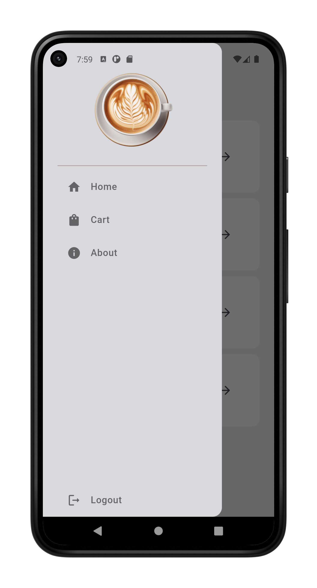
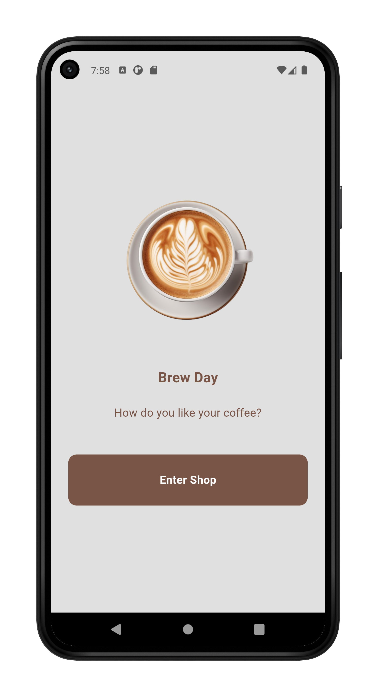
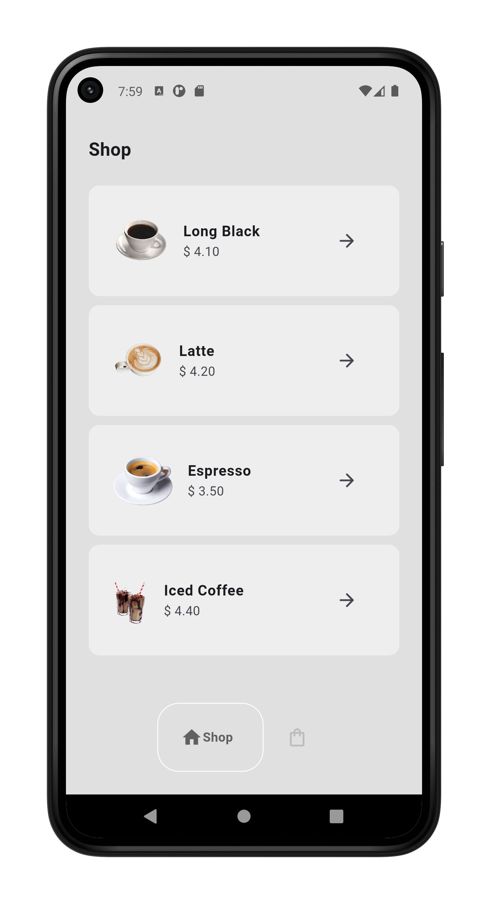
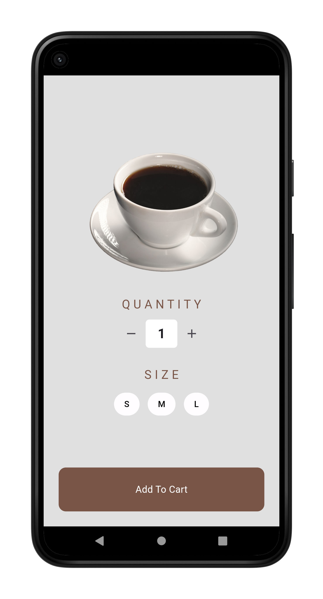
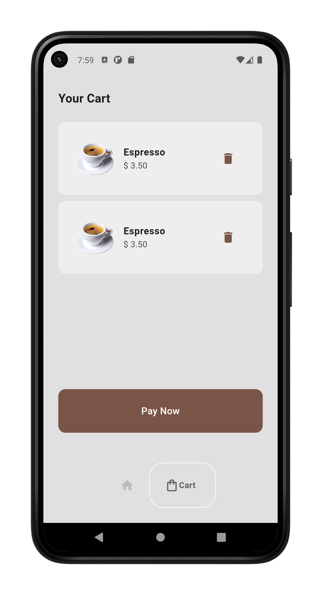

# ☕ Coffee App

This mobile application allows users to browse and purchase different types of coffee. Created using Flutter, it provides a smooth and responsive user interface, making the coffee buying process quick and enjoyable.

## 👨‍💻 Stack

- Framework: Flutter
- State Management: Bloc


## 🧬 Samples

| Drawer | Intro Screen | Shop Screen |
|---------|---------|---------|
|         |         |         |   

| Detail Screen | Cart Screen | 
|---------|---------|
|         |         | 

## 💪🏼 Getting Started

### Clone the project and cd into it

```bash
git clone https://github.com/takumade/coffee
cd ./coffee
```

### Install dependencies

```bash
flutter pub get
```

### Run

```bash
flutter run
```

## 🌻 Motivation

I am relearning Flutter, so I am practising......

## 🔗 Links

Special thanks to these people...

- [Mich Koko](https://github.com/mitchkoko)
